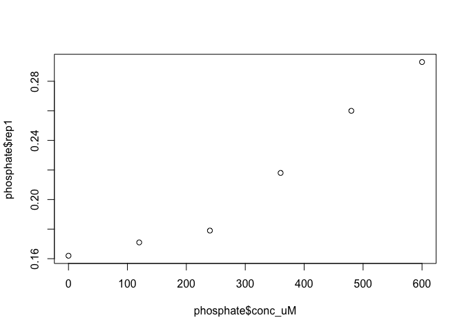
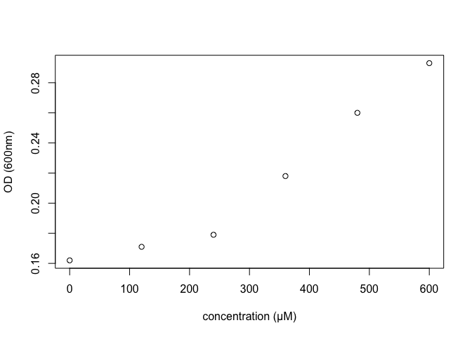
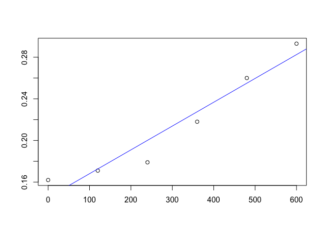
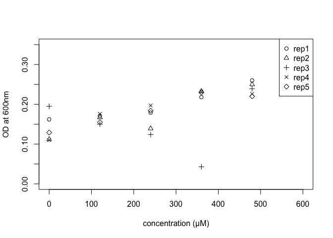
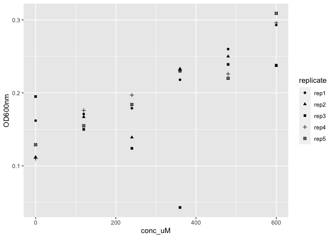
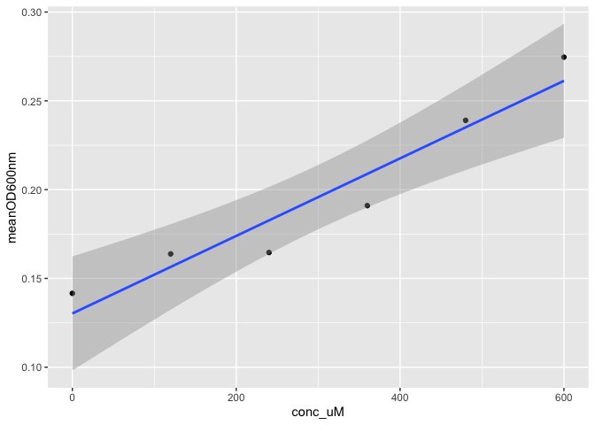

Basic Plotting in R
================
Ben Dickins
2021-12-27

# Preparation

## Loading Libraries

Before we can do today’s exercises we need to do something extra. We
need to get access to some extra functions that aren’t available in
“base” R. To do this we will load a package into R. In R packages are
called libraries and a library is a collection of functions that are
usually designed to do similar types of things (e.g., analyzing data in
a particular way). In this case we are going to load a really
“meta”-package (a package so big that it actually contains other
packages) and this is called the `tidyverse`.

``` r
library(tidyverse)
```

    ## ── Attaching packages ─────────────────────────────────────── tidyverse 1.3.1 ──

    ## ✓ ggplot2 3.3.5     ✓ purrr   0.3.4
    ## ✓ tibble  3.1.6     ✓ dplyr   1.0.7
    ## ✓ tidyr   1.1.4     ✓ stringr 1.4.0
    ## ✓ readr   2.1.0     ✓ forcats 0.5.1

    ## ── Conflicts ────────────────────────────────────────── tidyverse_conflicts() ──
    ## x dplyr::filter() masks stats::filter()
    ## x dplyr::lag()    masks stats::lag()

Now don’t worry about the “conflicts” message - this isn’t an error.
(TL;DR: all this means is that some functions in the tidyverse are going
to take precedence over functions with the same name in base R.). You
can find out more about the tidyverse at [their
webpage](https://www.tidyverse.org).

## Setup

Now you’ve got two tasks:

1.  Get your data in the right place. This means downloading the file
    named “phosphate_assay.tsv” and moving it to a suitable folder.
2.  Getting R to look in that place. For this one you will need to “set
    the working directory”.

I will remind you how to do #s 1 and 2 in my video.

## Read in and View Data

Now that we are in the right place, let’s read in the data, but this
time we are going to use a function from the tidyverse that works with
tab-separated values (files ending `.tsv`):

``` r
phosphate <- read_tsv("data/phosphate-assay.tsv")
```

    ## Rows: 6 Columns: 7

    ## ── Column specification ────────────────────────────────────────────────────────
    ## Delimiter: "\t"
    ## chr (1): sample
    ## dbl (6): conc_uM, rep1, rep2, rep3, rep4, rep5

    ## 
    ## ℹ Use `spec()` to retrieve the full column specification for this data.
    ## ℹ Specify the column types or set `show_col_types = FALSE` to quiet this message.

``` r
phosphate
```

    ## # A tibble: 6 × 7
    ##   sample     conc_uM  rep1  rep2  rep3  rep4  rep5
    ##   <chr>        <dbl> <dbl> <dbl> <dbl> <dbl> <dbl>
    ## 1 Standard_1       0 0.162 0.112 0.195 0.11  0.129
    ## 2 Standard_2     120 0.171 0.167 0.15  0.176 0.155
    ## 3 Standard_3     240 0.179 0.139 0.124 0.197 0.184
    ## 4 Standard_4     360 0.218 0.233 0.043 0.231 0.23 
    ## 5 Standard_5     480 0.26  0.25  0.239 0.226 0.22 
    ## 6 Standard_6     600 0.293 0.237 0.238 0.296 0.309

I will tell you a little bit about that object (which is called a
“tibble”) in the video and show you a few tricks to view the data in
different ways.

# Time to Draw Graphs and Analyze!

## Simple Plot

Did you notice how each replicate is a separate column? Let’s start by
drawing a graph with the concentration column (on the x axis) and the
first replicate (on the y axis):

``` r
plot(x = phosphate$conc_uM, y = phosphate$rep1)
```

<!-- --> It looks
like when the concentration goes up so does the value of the replicate
(measured as optical density at 600nm).

## Decorate the Plot

Maybe we should put those units into the plot properly:

``` r
plot(x = phosphate$conc_uM, y = phosphate$rep1, xlab = "concentration (μM)", ylab = "OD (600nm)")
```

<!-- -->

## Simple Regression

Let’s look at that relationship using a simple linear (regression)
model. The function for linear models is `lm()`. In this case we will
use this function to construct a model and assign the result to an
object called `model1`. We write the name of the model to view its key
properties:

``` r
model1 <- lm(rep1 ~ conc_uM, data=phosphate)
model1
```

    ## 
    ## Call:
    ## lm(formula = rep1 ~ conc_uM, data = phosphate)
    ## 
    ## Coefficients:
    ## (Intercept)      conc_uM  
    ##   0.1451905    0.0002288

So you can see that the slope or gradient is `0.0002288` while the y
intercept is `0.1451905`. You can find out much more about the model
using `summary(model1)`. This shows the R^2 value and carries out a
significance test. (We won’t go into this now).

## Adding Regression Line to Plot

``` r
plot(x = phosphate$conc_uM, y = phosphate$rep1, xlab = "", ylab = "")
abline(model1, col="blue")
```

<!-- --> Cool
right? We added the regression line to the plot. Did you notice how we
added empty information to the plot labels? Try typing this new line of
code:

`title(xlab = "concentration (μM)", ylab = "OD (600nm)")`

What happens? Like the `abline()` function above, the `title()` function
can be used to decorate a plot after you have drawn it.

## Five Replicates

Now the above is all very well, but we’ve only plotted one replicate.
Just for a second let’s remind ourselves of the column names in our data
object:

``` r
names(phosphate)
```

    ## [1] "sample"  "conc_uM" "rep1"    "rep2"    "rep3"    "rep4"    "rep5"

Let’s take the names from the 3rd to the last column and assign them to
a new object:

``` r
repcols <- names(phosphate)[3:7]
repcols
```

    ## [1] "rep1" "rep2" "rep3" "rep4" "rep5"

Now you can see we need to plot all five columns in repcols.

## Plotting Replicates

Now this is a bit more complicated. Here you’ll see two more functions
that can be used to add elements to a plot (`points()` and `legend()`) -
see if you can figure out what they do:

``` r
plot(phosphate$conc_uM, phosphate$rep1, pch = 1, ylim = c(0, 0.35), xlab = "", ylab = "")
points(phosphate$conc_uM, phosphate$rep2, pch = 2, xlab = "", ylab = "")
points(phosphate$conc_uM, phosphate$rep3, pch = 3, xlab = "", ylab = "")
points(phosphate$conc_uM, phosphate$rep4, pch = 4, xlab = "", ylab = "")
points(phosphate$conc_uM, phosphate$rep5, pch = 5, xlab = "", ylab = "")
title(xlab = "concentration (μM)", ylab = "OD at 600nm")
legend("topright", legend = repcols, pch = 1:5)
```

<!-- --> To
understand the functions you can use the `?` notation for example read
the help file for `?points` and see if you can find out what the `pch`
argument is doing…

# Plotting in Tidyverse

Tidyverse is a bit of a weird name isn’t it? Well it’s actually a really
good name because it’s all about how data is organised. Looking at the
data in the phosphate object we can see that each row contains five y
values (one for each replicate), but in “tidy” data we expect each
observation to be on a separate row and each column to be a single
variable. For more detail on this see [this
reference](https://r4ds.had.co.nz/tidy-data.html).

## Tidy Data

How can we get the `phosphate` data into a tidy format? We should have
one column for optical density (the y value) and, because every
measurement should have its own row, we also need a column to tell us
what replicate each measurement is. There is a special helper function
in `tidyverse` to help us do this and that is `pivot_longer()`:

``` r
phosphate_long <- pivot_longer(phosphate, rep1:rep5, names_to = "replicate", values_to = "OD600nm")
phosphate_long
```

    ## # A tibble: 30 × 4
    ##    sample     conc_uM replicate OD600nm
    ##    <chr>        <dbl> <chr>       <dbl>
    ##  1 Standard_1       0 rep1        0.162
    ##  2 Standard_1       0 rep2        0.112
    ##  3 Standard_1       0 rep3        0.195
    ##  4 Standard_1       0 rep4        0.11 
    ##  5 Standard_1       0 rep5        0.129
    ##  6 Standard_2     120 rep1        0.171
    ##  7 Standard_2     120 rep2        0.167
    ##  8 Standard_2     120 rep3        0.15 
    ##  9 Standard_2     120 rep4        0.176
    ## 10 Standard_2     120 rep5        0.155
    ## # … with 20 more rows

Look at the “arguments” (separated by commas) inside `pivot_longer()`.
First we pass it the object containing the data, then we tell it which
columns contain the data we want to transform/pivot, then we use
`names_to` to create a new column that contains these old column names.
Finally we use `values_to` to create the *single* column containing the
data. Learn more at the above reference or using `?pivot_longer`. Take a
good look at the **tidy** data in our new `phosphate_long` object.

## Plot with “Grammar of Graphics”

Tidyverse contains an awesome function called `ggplot()`. It can be a
little hard to learn at first (you may find this [reference
chapter](https://r-graphics.org/chapter-ggplot2) helpful), but here is
how we can draw a plot with all the data in it:

``` r
ggplot(phosphate_long, aes(x=conc_uM, y=OD600nm, shape=replicate)) + geom_point()
```

<!-- --> First
we tell it the name of the data. Then the next argument uses the `aes()`
function to tell `ggplot()` the “aesthetic mappings”, i.e., which
variables are associated with which features of the plot. That’s kind of
simple for the x and y axes, but try replacing `shape` in the above code
with `colour`. What do you see? What if you remove that argument
altogether.

Then there is this slightly weird (and unique to `ggplot()`) feature
where we add the geometric function that is used to make the plot (in
this case `geom_point`). Keeping the `colour` change you made above, try
replacing `geom_point()` with `geom_line()`. What do you see? Does that
make sense? (It may be pretty but the answer is no! You can’t
*interpolate* in that way!)

## Add Regression Line

In `ggplot()` this is really each to do using the `stat_smooth()`
function. We just need to add one more thing to the plot (and you might
notice that we put the functions on different lines here which is fine
as long as there is a plus on every line if we expect more functions):

``` r
ggplot(phosphate_long, aes(x=conc_uM, y=OD600nm)) + 
  geom_point(aes(colour=replicate)) + 
  stat_smooth(method=lm)
```

    ## `geom_smooth()` using formula 'y ~ x'

 The only thing
you might notice here if you look really closely is that we moved the
colour attribute into the `geom_points()` function. Try moving it back
to the main `ggplot()` call. What happens?

## Plot with Average Values

This is actually very complex, so please don’t worry if you don’t
understand this last example which introduces an idea called the pipe
`%>%`, but it shows you how you can summarize data and send it into the
next function (and ultimately into `ggplot()`):

``` r
phosphate_long %>% 
  group_by(sample, conc_uM) %>% 
  summarise(meanOD600nm = mean(OD600nm)) %>% 
  ggplot(aes(x=conc_uM, y=meanOD600nm)) + geom_point() + stat_smooth(method=lm)
```

    ## `summarise()` has grouped output by 'sample'. You can override using the `.groups` argument.

    ## `geom_smooth()` using formula 'y ~ x'

<!-- --> Generally
you won’t need a complex example like this (instead see Figure
\\@ref{fig:best-ggplot} which has the advantage that we can see all the
data)…

# References

These references were linked above:

-   Chang, W., 2018. R graphics cookbook: practical recipes for
    visualizing data. O’Reilly Media. 2nd edition

-   Wickham, H. and Grolemund, G., 2016. R for data science: import,
    tidy, transform, visualize, and model data. ” O’Reilly Media, Inc.”.

But when attributing, we mustn’t forget about software! R actually
contains a function that provides us with bibliographic details! For all
of R:

``` r
citation()
```

    ## 
    ## To cite R in publications use:
    ## 
    ##   R Core Team (2021). R: A language and environment for statistical
    ##   computing. R Foundation for Statistical Computing, Vienna, Austria.
    ##   URL https://www.R-project.org/.
    ## 
    ## A BibTeX entry for LaTeX users is
    ## 
    ##   @Manual{,
    ##     title = {R: A Language and Environment for Statistical Computing},
    ##     author = {{R Core Team}},
    ##     organization = {R Foundation for Statistical Computing},
    ##     address = {Vienna, Austria},
    ##     year = {2021},
    ##     url = {https://www.R-project.org/},
    ##   }
    ## 
    ## We have invested a lot of time and effort in creating R, please cite it
    ## when using it for data analysis. See also 'citation("pkgname")' for
    ## citing R packages.

And for a particular package:

``` r
citation("tidyverse")
```

    ## 
    ##   Wickham et al., (2019). Welcome to the tidyverse. Journal of Open
    ##   Source Software, 4(43), 1686, https://doi.org/10.21105/joss.01686
    ## 
    ## A BibTeX entry for LaTeX users is
    ## 
    ##   @Article{,
    ##     title = {Welcome to the {tidyverse}},
    ##     author = {Hadley Wickham and Mara Averick and Jennifer Bryan and Winston Chang and Lucy D'Agostino McGowan and Romain François and Garrett Grolemund and Alex Hayes and Lionel Henry and Jim Hester and Max Kuhn and Thomas Lin Pedersen and Evan Miller and Stephan Milton Bache and Kirill Müller and Jeroen Ooms and David Robinson and Dana Paige Seidel and Vitalie Spinu and Kohske Takahashi and Davis Vaughan and Claus Wilke and Kara Woo and Hiroaki Yutani},
    ##     year = {2019},
    ##     journal = {Journal of Open Source Software},
    ##     volume = {4},
    ##     number = {43},
    ##     pages = {1686},
    ##     doi = {10.21105/joss.01686},
    ##   }

# Session Information

For reproducibility we sometimes print out information about our setup
and computer:

``` r
sessionInfo()
```

    ## R version 4.1.2 (2021-11-01)
    ## Platform: x86_64-apple-darwin17.0 (64-bit)
    ## Running under: macOS Catalina 10.15.7
    ## 
    ## Matrix products: default
    ## BLAS:   /Library/Frameworks/R.framework/Versions/4.1/Resources/lib/libRblas.0.dylib
    ## LAPACK: /Library/Frameworks/R.framework/Versions/4.1/Resources/lib/libRlapack.dylib
    ## 
    ## locale:
    ## [1] en_GB.UTF-8/en_GB.UTF-8/en_GB.UTF-8/C/en_GB.UTF-8/en_GB.UTF-8
    ## 
    ## attached base packages:
    ## [1] stats     graphics  grDevices utils     datasets  methods   base     
    ## 
    ## other attached packages:
    ## [1] forcats_0.5.1   stringr_1.4.0   dplyr_1.0.7     purrr_0.3.4    
    ## [5] readr_2.1.0     tidyr_1.1.4     tibble_3.1.6    ggplot2_3.3.5  
    ## [9] tidyverse_1.3.1
    ## 
    ## loaded via a namespace (and not attached):
    ##  [1] Rcpp_1.0.7       lattice_0.20-45  lubridate_1.8.0  assertthat_0.2.1
    ##  [5] digest_0.6.29    utf8_1.2.2       R6_2.5.1         cellranger_1.1.0
    ##  [9] backports_1.4.0  reprex_2.0.1     evaluate_0.14    httr_1.4.2      
    ## [13] highr_0.9        pillar_1.6.4     rlang_0.4.12     readxl_1.3.1    
    ## [17] rstudioapi_0.13  Matrix_1.3-4     rmarkdown_2.11   splines_4.1.2   
    ## [21] labeling_0.4.2   bit_4.0.4        munsell_0.5.0    broom_0.7.10    
    ## [25] compiler_4.1.2   modelr_0.1.8     xfun_0.28        pkgconfig_2.0.3 
    ## [29] mgcv_1.8-38      htmltools_0.5.2  tidyselect_1.1.1 fansi_0.5.0     
    ## [33] crayon_1.4.2     tzdb_0.2.0       dbplyr_2.1.1     withr_2.4.2     
    ## [37] grid_4.1.2       nlme_3.1-153     jsonlite_1.7.2   gtable_0.3.0    
    ## [41] lifecycle_1.0.1  DBI_1.1.1        magrittr_2.0.1   scales_1.1.1    
    ## [45] cli_3.1.0        stringi_1.7.6    vroom_1.5.6      farver_2.1.0    
    ## [49] fs_1.5.0         xml2_1.3.2       ellipsis_0.3.2   generics_0.1.1  
    ## [53] vctrs_0.3.8      tools_4.1.2      bit64_4.0.5      glue_1.5.0      
    ## [57] hms_1.1.1        parallel_4.1.2   fastmap_1.1.0    yaml_2.2.1      
    ## [61] colorspace_2.0-2 rvest_1.0.2      knitr_1.36       haven_2.4.3
